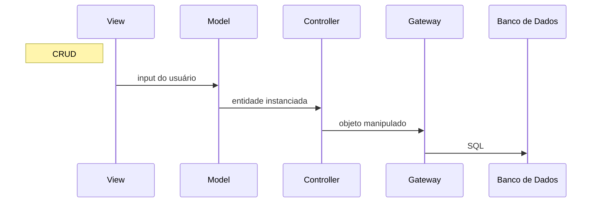

# Introdução

Lorem ipsum dolor sit amet, consectetur adipiscing elit. Duis auctor posuere iaculis. Nunc porttitor leo non magna fringilla mollis. Nam pellentesque nunc ut tellus fermentum, sit amet ornare turpis bibendum. Sed eu justo sit amet dui porttitor volutpat. Ut id eleifend arcu, auctor egestas ante. Etiam eu aliquam quam, sit amet rhoncus sapien. Pellentesque ac mauris congue, porttitor dolor eget, eleifend ligula. In egestas velit at eleifend ullamcorper. Donec at sagittis ligula, id tincidunt neque. Donec vel nunc luctus odio feugiat pharetra. Aliquam dictum blandit lobortis. Curabitur lorem lacus, laoreet ut aliquam eu, semper vel leo. Vivamus est justo, consectetur et sem sit amet, aliquam posuere purus.


## Como executar o projeto

### Configurando o Banco de Dados

Antes da primeira vez que o projeto for rodado, é preciso criar o banco de dados localmente. Isso é possível
com [este script](db/setup_postgres.sh) ou diratamente de um CLI psql:

```shell
sudo -iu postgres psql
```

```postgresql
CREATE ROLE clube_dba with PASSWORD '1234567' CREATEDB LOGIN;
CREATE DATABASE db_cluve_esportivo with OWNER clube_dba;
```

### Configurando o ambiente

Crie um ambiente virtual e instale os requerimentos:

```shell
python3 -m venv .venv-clube
```

```shell
pip install -r requirements.txt
```

Inicialize o projeto:

```shell
flask --app src run
```

# Modelo Entidade Relacionamento (MER)


O diagrama foi criado usando a aplicação [app.diagrams](https://app.diagrams.net/) e versionada com a
seguinte [imagem svg](diagramas_e_recursos/mer_clube.drawio.svg).

# Modelo Relacional


O diagrama foi criado usando a ferramenta de tabelas do PyCharm.

# Exemplos de Consulta em Algebra relacional

# Avaliação das formas normais

# Diagrama da camada de mapeamento para uma tabela do banco de dados



O Projeto com seus vários módulos possui um padrão de arquitetura baseada em Model View Controller (MVC). A camada
`Gateway`
funciona como Data Access Object (DAO), abstraindo o acesso ao banco de dados.