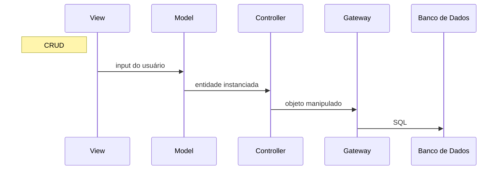

# Introdução

O projeto foi desenvolvido para gerenciar as atividades de um clube esportivo, com o objetivo de melhorar a sua organização. A estrutura do banco de dados foi projetada com 12 entidades, cobrindo os aspectos principais do clube, como associados, funcionários, eventos e instalações.

O sistema adotou o padrão CRUD (Criação, Leitura, Atualização e Deleção) para realizar operações sobre essas entidades, de acordo com as especificações fornecidas no início do projeto.

Em relação ao banco de dados, as relações "associados" e "funcionários" identificam unicamente uma pessoa por meio do CPF. Para as demais tabelas, foi utilizado um número serial autoincrementado como identificador das tuplas. 

O sistema foi desenvolvido utilizando a linguagem de programação Python `3.12` e o framework Flask para a interface gráfica web, baseada em Blueprints e Views do próprio Flask. O banco de dados relacional foi implementado usando PostgreSQL.

## Como executar o projeto

### Configurando o Banco de Dados

Para executar o projeto pela primeira vez, é necessário ter o PostgreSQL instalado na máquina. A configuração do banco de dados pode ser feita localmente utilizando o [script de setup](db/setup_postgres.sh) ou executando os seguintes comandos diretamente no psql:

1. Acesse o shell do PostgreSQL como usuário postgres:
```shell
sudo -iu postgres psql
```
2. No terminal do psql, crie a role, o password e o banco de dados com os seguintes comandos:
```postgresql
CREATE ROLE clube_dba with PASSWORD '1234567' CREATEDB LOGIN;
CREATE DATABASE db_cluve_esportivo with OWNER clube_dba;
```

### Configurando o Ambiente Virtual

Para executar o projeto, é necessário ter o Python 3.12 instalado na máquina. Além disso, é recomendado criar um ambiente virtual para instalar as dependências do projeto. Para isso, siga os passos abaixo:

1. Crie um ambiente virtual:

```shell
python3 -m venv .venv-clube
```
2. Ative o ambiente virtual:
- No Linux/macOS:
```shell
source .venv-clube/bin/activate
```
- No Windows:
```shell
.venv-clube\Scripts\activate
```

3. Instale as dependências do projeto:
```shell
pip install -r requirements.txt
```

4. Inicie o projeto:
```shell
flask --app src run
```

# Modelo Entidade Relacionamento (MER)
O diagrama foi criado utilizando a ferramenta [diagrams.net](https://app.diagrams.net/). O MER que está em formato SVG foi versionado pelo arquivo [imagem svg](diagramas_e_recursos/mer_clube.drawio.svg). Abaixo, segue a vizualização direta do diagrama:


# Modelo Relacional
O diagrama foi criado utilizando a ferramenta de modelagem do PyCharm, que permite ver a estrutura das tabelas e seus relacionamentos. A versão mais recente do diagrama pode ser visualizada abaixo:


# Exemplos de Consultas em Algebra relacional
Como foi solicitado pela especificação do projeto, foram criadas cinco consultas em álgebra relacional que envolvam pelo menos três tabelas. As consultas estão disponíveis no arquivo [Algebra Relacional_02](https://github.com/nori-marcos/clubeEsportivo/blob/main/diagramas_e_recursos/Algebra%20Relacional_02.pdf)

# Avaliação das formas normais
O projeto foi desenvolvido de acordo com a Terceira Forma Normal (3FN), o que implica que também atende aos requisitos da Primeira e Segunda Formas Normais (1FN e 2FN). Abaixo segue a avaliação das formas normais de cinco tabelas do banco de dados:

1. Tabela `associados`:
- 1FN: A tabela possui apenas valores atômicos, sem atributos multivalorados. A entidade `associados` do modelo MER tem o atributo multivalorado `telefones`, mas foi normalizado na tabela `associados_telefones`.
- 2FN: A tabela possui chave candidata `{cpf}` e os atributos `nome`, `foto`, `data_adesao`, `data_nascimento`, `endereco`, `email`, `associado_titular` e `contrato` são complementos da chave e totalmente dependentes da chave candidata.
- 3FN: Os atributos não chave `nome`, `foto`, `data_adesao`, `data_nascimento`, `endereco`, `email`, `associado_titular` e `contrato` são dependentes não-transitivos da chave candidata `{cpf}`.

2. Tabela `funcionarios`:
- 1FN: Muito similar à tabela `associados`, a tabela `funcionarios` possui apenas valores atômicos. Seguindo a mesma lógica, o atributo multivalorado `telefones` foi normalizado na tabela `funcionarios_telefones`.
- 2FN: A tabela possui chave candidata `{cpf}` e os atributos `nome`, `data_nascimento`, `data_admissao`, `email`, `salario`, `endereco`, `cargo` e `departamento` são complementos da chave e totalmente dependentes da chave candidata.
- 3FN: Os atributos não chave `nome`, `data_nascimento`, `data_admissao`, `email`, `salario`, `endereco`, `cargo` e `departamento` são dependentes não-transitivos da chave candidata `{cpf}`.

3. Tabela `cargos`:
- 1FN: A tabela possui apenas valores atômicos, sem atributos multivalorados.
- 2FN: A tabela possui chave candidata `{id_cargo}` e os atributos `nome`, `descricao` e `salario_base` são complementos da chave e totalmente funcionalmente dependentes da chave candidata. Ou seja, para cada `{id_cargo}` define funcionalmente um único valor para `nome`, `descricao` e `salario_base`.
- 3FN: Os atributos não chave `nome`, `descricao` e `salario_base` são dependentes não-transitivos da chave candidata `{id_cargo}`. Ou seja, um atributo não chave não pode definir funcionalmente outro atributo não chave.

4. Tabela `eventos`:
- 1FN: A tabela possui apenas valores atômicos, sem atributos multivalorados.
- 2FN: A tabela possui chave candidata `{id_evento}` e os atributos `nome`, `data` e `descricao` são complementos da chave e totalmente funcionalmente dependentes daquela chave.
- 3FN: Os atributos não chave `nome`, `data` e `descricao` são dependentes não-transitivos da chave candidata `{id_evento}`.

5. Tabela `instalacoes`:
- 1FN: A tabela possui apenas valores atômicos, sem atributos multivalorados.
- 2FN: A tabela possui chave candidata `{id_instalacao}` e os atributos `nome`, `em_funcionamento` e `capacidade` são complementos da chave e totalmente funcionalmente dependentes daquela chave.
- 3FN: Os atributos não chave `nome`, `em_funcionamento` e `capacidade` são dependentes não-transitivos da chave candidata `{id_instalacao}`.

# Diagrama da camada de mapeamento para uma tabela do banco de dados



O Projeto com seus vários módulos possui um padrão de arquitetura baseada em Model View Controller (MVC). A camada
`Gateway`
funciona como Data Access Object (DAO), abstraindo o acesso ao banco de dados.
