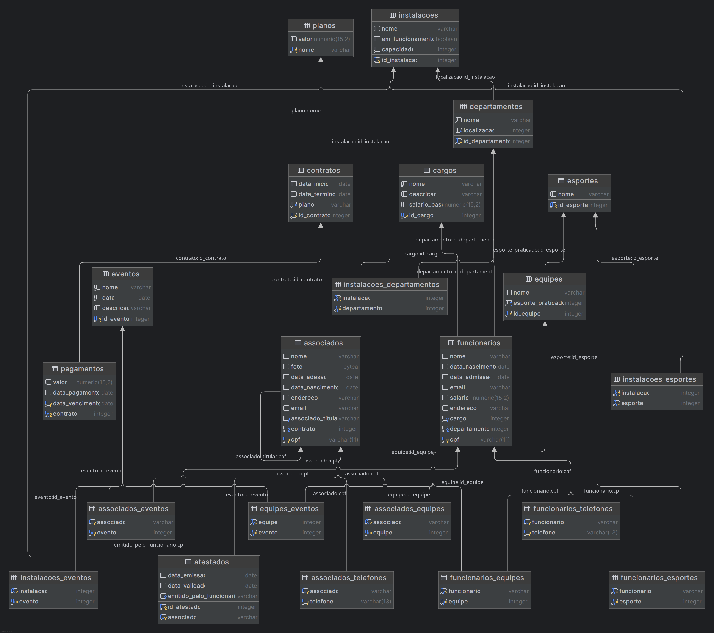
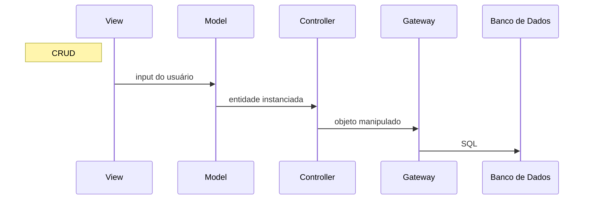

# Introdução

O projeto pretende gerenciar as atividades de um clube esportivo, atendendo às necessidades de funcionários e
associados. Foram definidas 12 entidades, sendo as principais: associado, funcionário, evento e instalação. Foi adotado
o padrão CRUD para operações de criação, leitura, atualização e deleção das entidades, conforme especificação do
projeto.

Associados e funcionários têm como chave primária o CPF. Como identificador das tuplas nas demais tabelas, foi utilizado
um número serial autoincrementado.

O sistema será desenvolvido utilizando a linguagem de programação Python `3.12` - framework Flask - e o banco de dados
PostgreSQL. A interface do usuário é web, baseada em blueprint e views do próprio Flask.

## Como executar o projeto

### Configurando o Banco de Dados

Antes da primeira vez que o projeto for rodado, é preciso criar o banco de dados localmente. Isso é possível
com [este script](db/setup_postgres.sh) ou diratamente de um CLI psql:

```shell
sudo -iu postgres psql
```

```postgresql
CREATE ROLE clube_dba with PASSWORD '1234567' CREATEDB LOGIN;
CREATE DATABASE db_cluve_esportivo with OWNER clube_dba;
```

### Configurando o ambiente

Crie um ambiente virtual e instale os requerimentos:

```shell
python3 -m venv .venv-clube
```

```shell
pip install -r requirements.txt
```

Inicialize o projeto:

```shell
flask --app src run
```

# Modelo Entidade Relacionamento (MER)


O diagrama foi criado usando a aplicação [app.diagrams](https://app.diagrams.net/) e versionada com a
seguinte [imagem svg](diagramas_e_recursos/mer_clube.drawio.svg).

# Modelo Relacional


O diagrama foi criado usando a ferramenta de tabelas do PyCharm.

# Exemplos de Consulta em Algebra relacional

### Exemplo 1

Uma lista de todos os titulares com pagamentos irregulares e seus telefones.

```sql
SELECT a.cpf, a.nome, p.contrato, p.data_vencimento, t.telefone
FROM (SELECT * FROM associados WHERE associado_titular IS NULL) AS a
         INNER JOIN (SELECT contrato, data_vencimento
                     FROM pagamentos
                     WHERE (data_vencimento < data_pagamento)
                        or (data_pagamento IS NULL))AS p
                    ON (p.contrato = a.contrato)
         LEFT JOIN associados_telefones AS t
                   ON (t.associado = a.cpf);
```

Com algebra relacional:

$\pi_{(a.cpf, a.nome, p.contrato, p.data\_vencimento, t.telefone)}
(\sigma_{p.data\_vencimento < p.data\_pagamento\ OR\ data\_pagamento = null}
(\rho_{a}(associados) \times \rho_{p(contrato, data\_vencimento)} (pagamentos) \times \rho_{t} (telefones)))$

$\vartriangleright\circ\vartriangleleft$
### Exemplo 2

Explicação loremipsum

```sql

```

Com algebra relacional:

$\pi$

### Exemplo 3

Explicação loremipsum

```sql

```

Com algebra relacional:

$\pi$

# Avaliação das formas normais

lorem ipsum

# Diagrama da camada de mapeamento para uma tabela do banco de dados



O Projeto com seus vários módulos possui um padrão de arquitetura baseada em Model View Controller (MVC). A camada
`Gateway` funciona como Data Access Object (DAO), abstraindo o acesso ao banco de dados.
